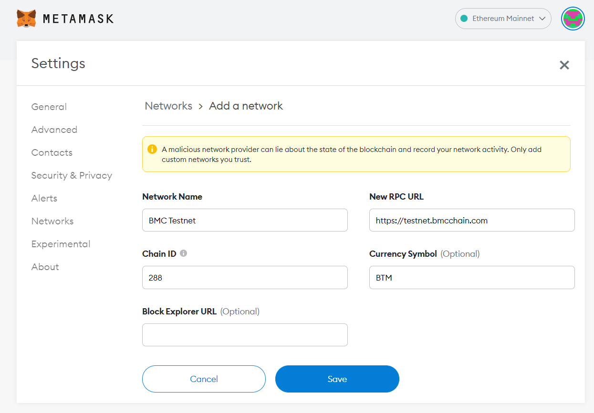
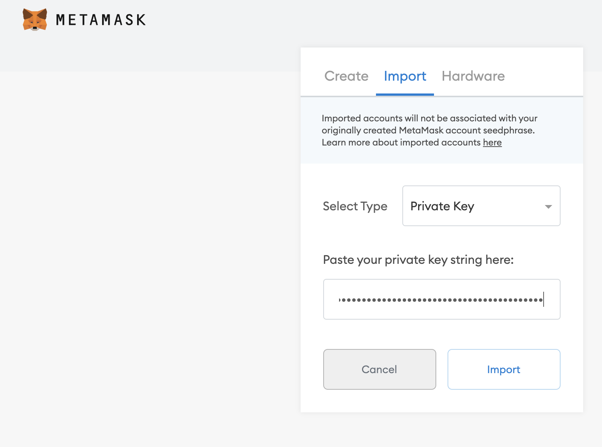
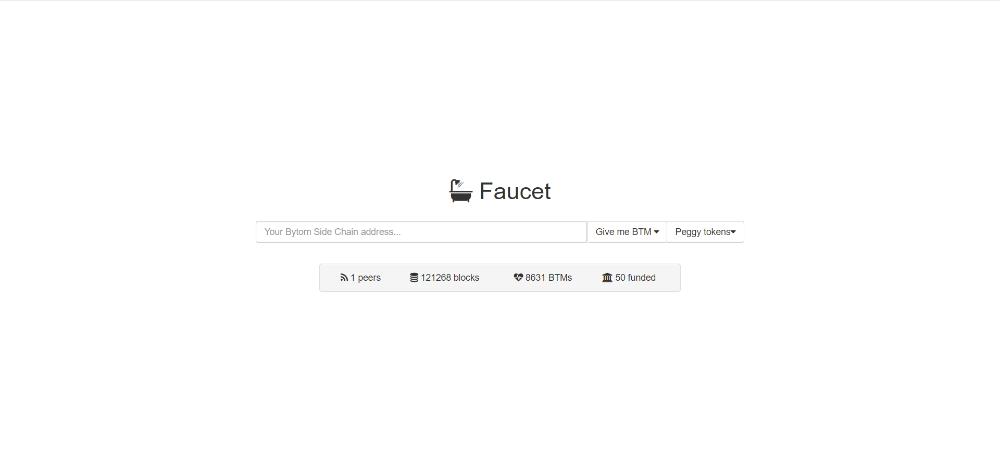
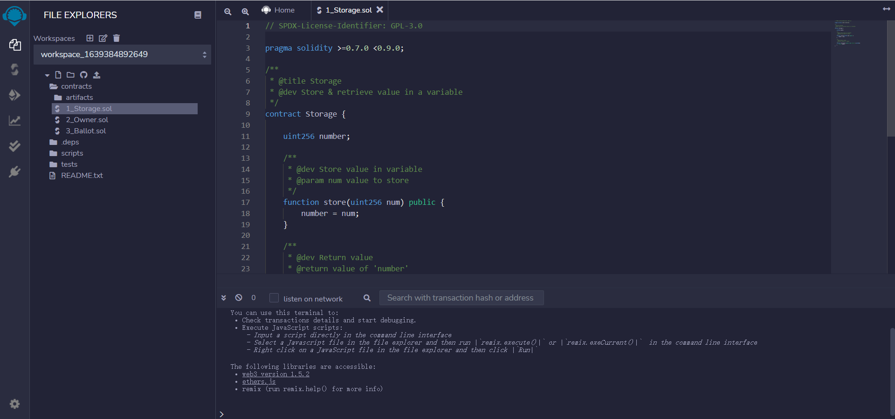
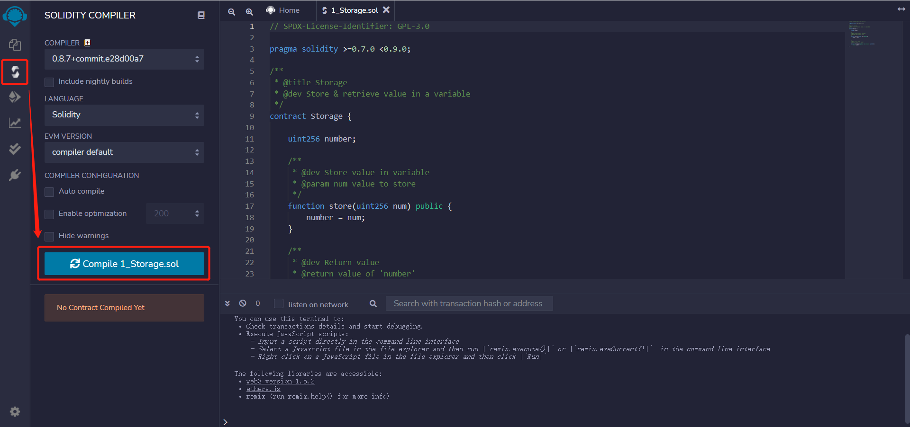
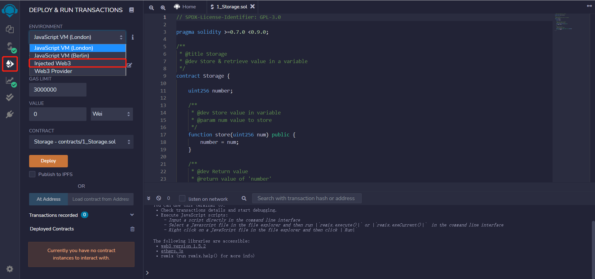
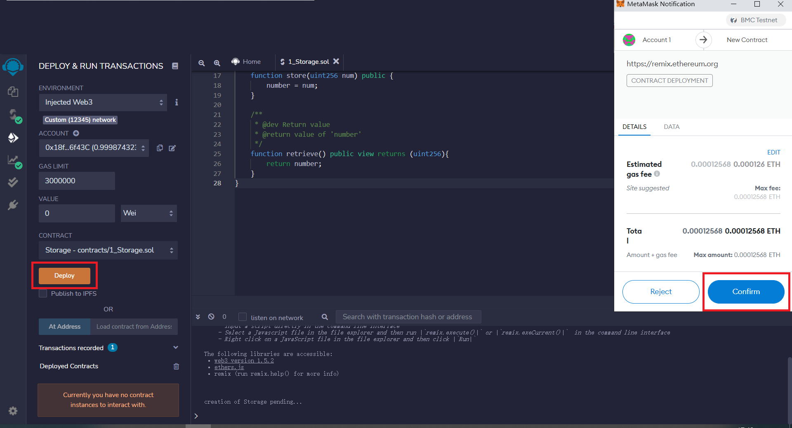
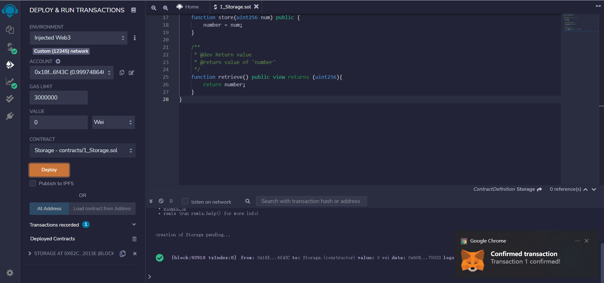
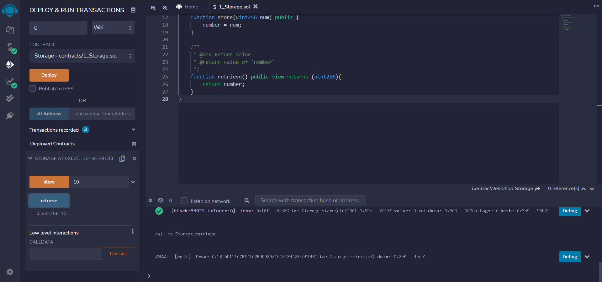

# Testnet Quick Start

## Prepare Wallet

we use metamask , and the introduction is as follow:

[What’s the Metamask](https://metamask.io/index.html)

[Guide for Metamask](https://docs.metamask.io/guide/)

### 1. Config Metamask for BMC Testnet

- NetWork Name: BMC Testnet
- RPC URL: https://testnet.bmcchain.com
- Chain ID: 189
- Currency Symbol: BTM
- Block Explorer URL: https://bmctestnet.blockmeta.com/

### 2. Create a new account or import an existing account

## Get testnet token

[https://bmc.bytom.io/faucet/](https://bmc.bytom.io/faucet/)

## Deploy smart contract

we use remix to write,compile,deploy the smart contract
remix is a "no-setup required" browser IDE for developing EVM smart contracts.

### 1.Prepare smart contract

Go to [https://remix.ethereum.org/](https://remix.ethereum.org/)
There are some contracts in the File Explorer. Select any of these contracts. In this example, we use `Storage.sol`, or you can write smart contract yourself

### 2.Compile smart contract

On the left bar, select the `Solidity Compiler` and compile the contract.

### 3.Deploy smart contract

On the left bar, select the `Deploy and Run` option. Select `injected web3` as the environment. This will open a metamask popup for you to confirm connecting your Metamask to Remix. Hit confirm.

Now that your account is connected, you are able to deploy the contract. Press the Deploy button. A metamask pop-up will appear asking you to confirm. Confirm the transaction

the smart contract was successfully deployed

### 4. Interact with smart contract

Now, you are able to interact with the contract through Remix. For `Storage.sol`, input 10 and click store. This will open a Metamask pop-up asking you to confirm. Confirm the transaction. Then, click retrieve to get the number, which should be 10.

