# 测试网快速入门

## 准备钱包

我们使用的是 metamask ，介绍如下：

[什么是Metamask](https://metamask.io/index.html)

[Metamask指南](https://docs.metamask.io/guide/)

### 1. 为 BMC 测试网配置 Metamask

- 网络名称: BMC测试网

- RPC URL: https://testnet.bmcchain.com

- 链 ID: 189

- 代币名称: BTM

- 区块链浏览器网址: https://bmctestnet.blockmeta.com/

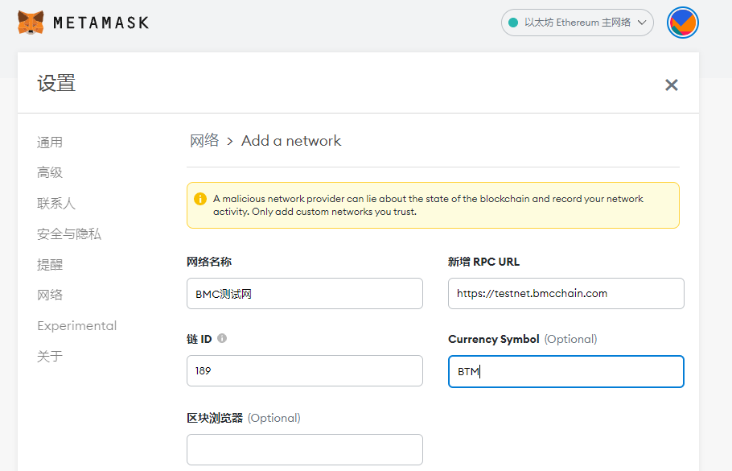

### 2. 创建新帐户或导入现有帐户

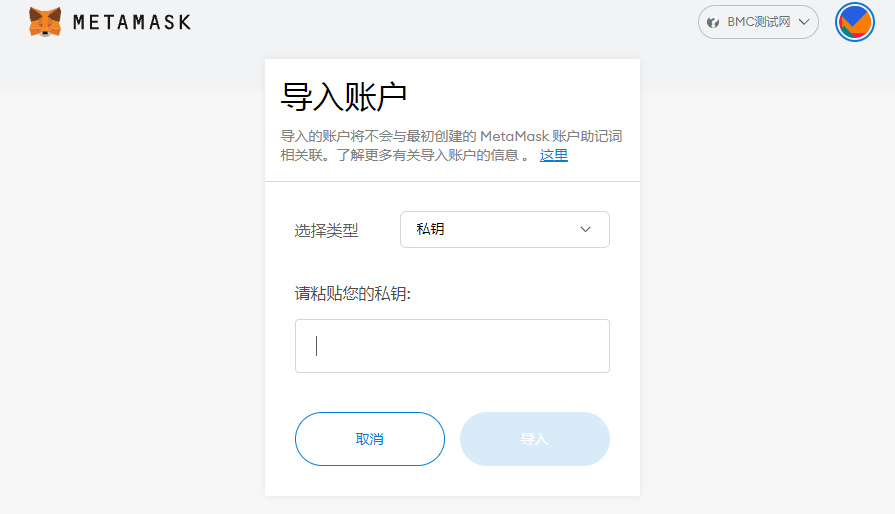

## 获取测试网Token

[https://bmc.bytom.io/faucet/](https://bmc.bytom.io/faucet/)

复制地址

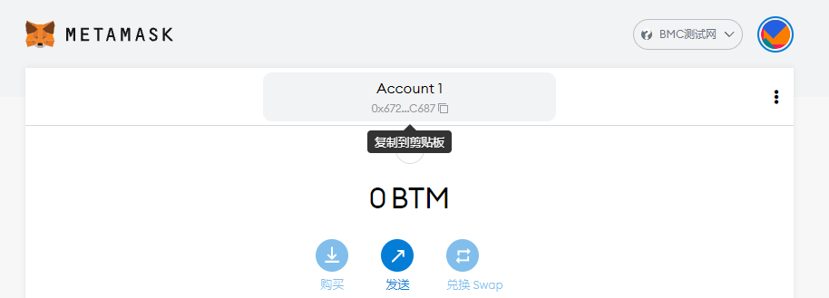

获取测试Token

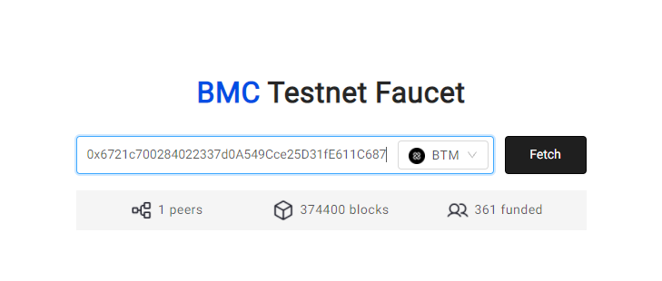

获取成功

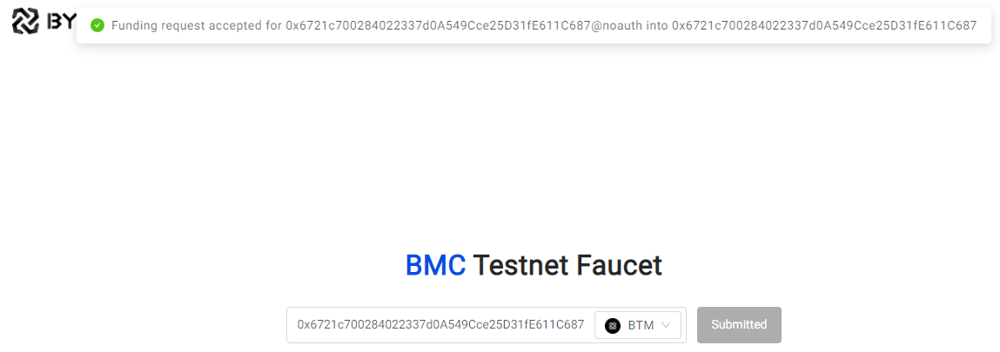

余额已改变

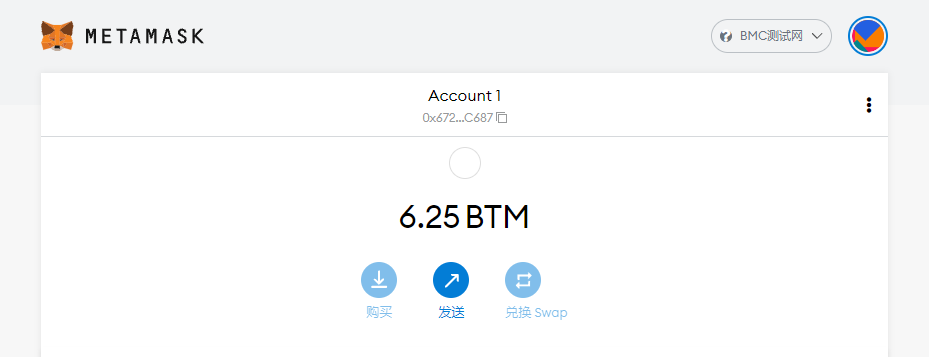

## 部署智能合约

我们使用 remix 来编写、编译、部署智能合约
remix 是一个“无需设置”的浏览器 IDE，用于开发 EVM 智能合约。

### 1.准备智能合约

前往 [https://remix.ethereum.org/](https://remix.ethereum.org/)
文件资源管理器中有一些合约。 选择这些合约中的任何一个。 在这个例子中，我们使用`Storage.sol`，或者你也可以自己编写智能合约。

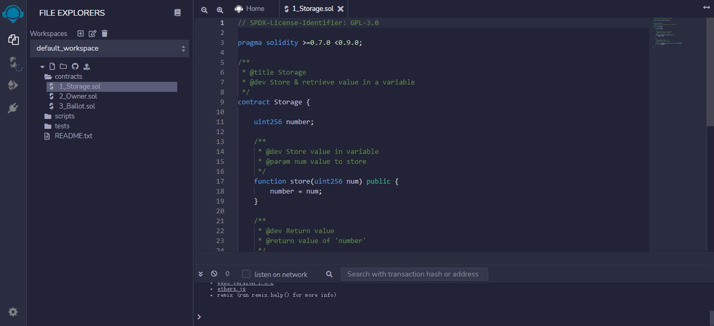

### 2.编译智能合约

在左侧栏上，选择“Solidity Compiler”并编译合约。

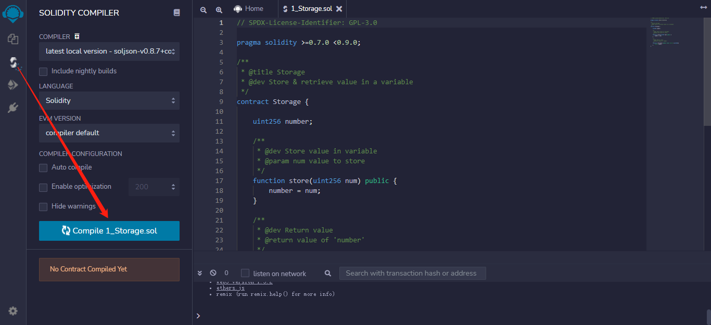

### 3.部署智能合约

在左侧栏上，选择`部署和运行`选项。 选择`injected web3`作为环境。 这里会弹出一个 metamask 窗口，确认是否将 Metamask 连接到 Remix，点击下一步，点击连接。

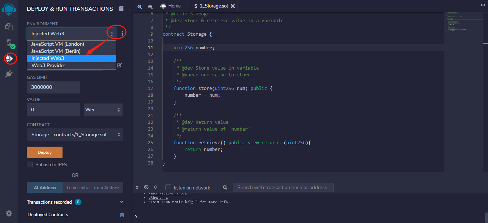

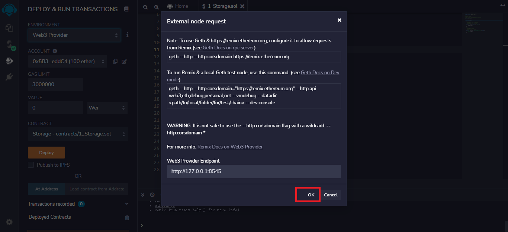

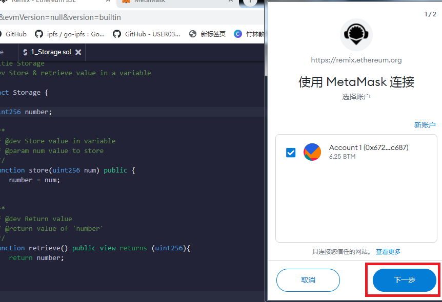

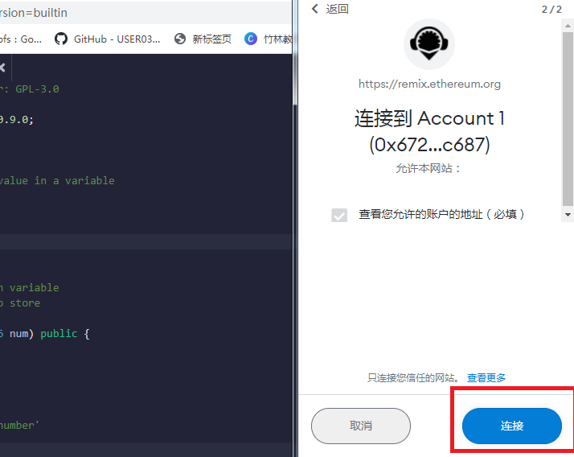

现在您的帐户已连接，您可以部署合约，点击部署按钮，弹出 metamask 窗口，提示是否确认，点击确认交易。

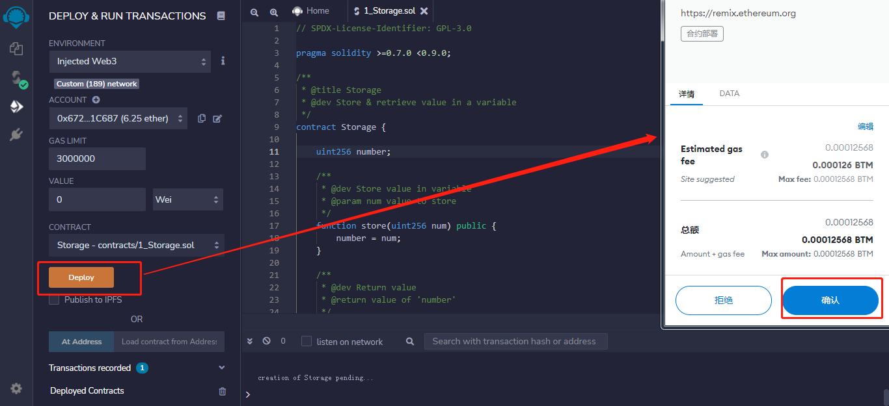

智能合约部署成功

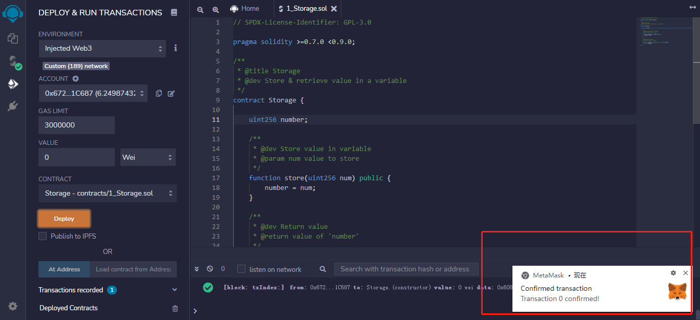

### 4. 与智能合约交互

现在，您可以通过 Remix 与合约进行交互。 对于`Storage.sol`，输入 10 并单击 store。

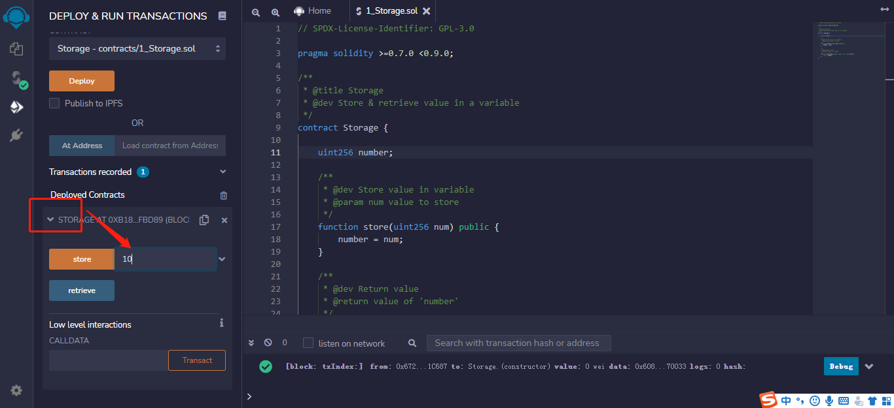

这里会打开一个 Metamask 弹出窗口，询问是否确认，确认交易。 

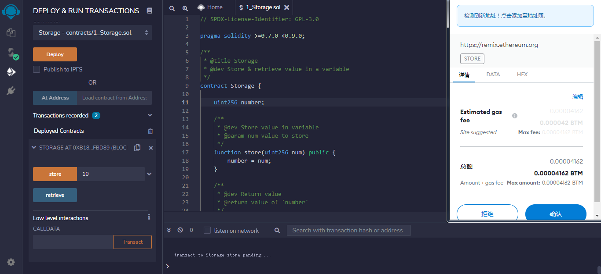

弹出交易成功提示

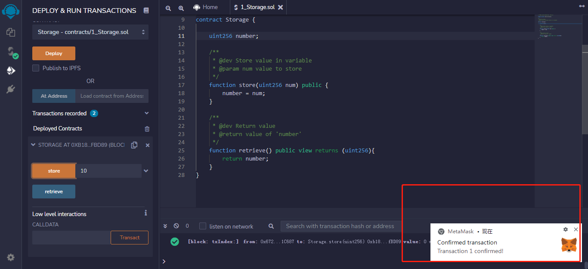

然后单击检索以获取数值，这里的数值应为 10。

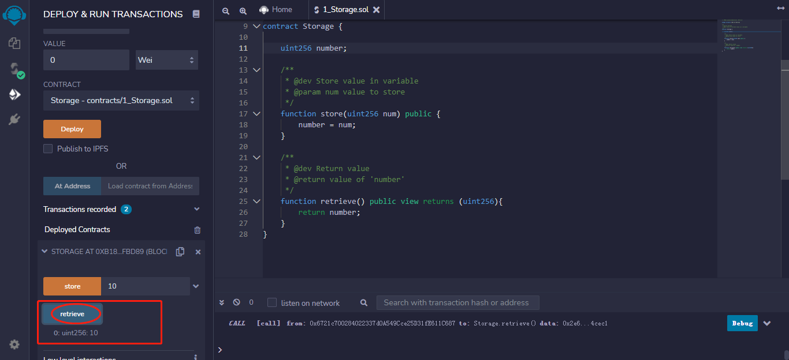

