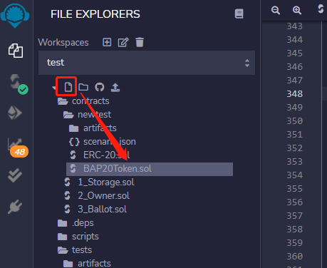
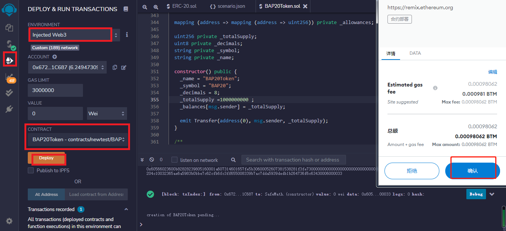
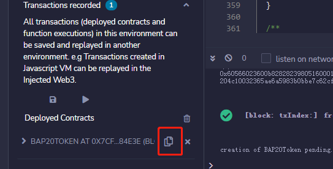
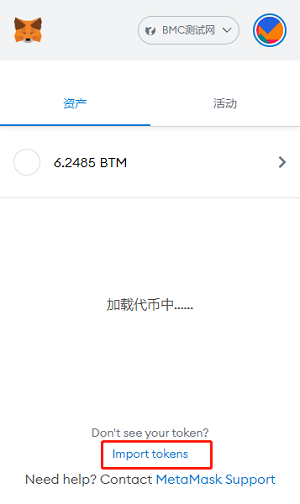
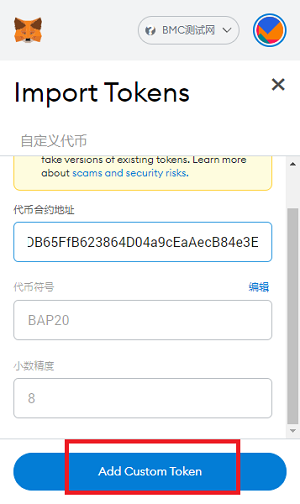

## 发行 BAP20 资产

### 1.准备BAP20合约

我们使用 Remix 来编写、编译、部署智能合约。

Remix 是一个“无需设置”的浏览器 IDE，用于开发 EVM 智能合约。

点击 [https://remix.ethereum.org/](https://remix.ethereum.org/) 打开Remix。

选择Solidity语言新建BAP20合约，这里将合约命名为`BAP20Token.sol`，您也可以自行指定。

代码内容您可以自己编写或点击[此处](https://github.com/Bytom/bmc-genesis-contract/blob/main/contracts/bap20_template/BAP20Token.template)复制代码。

之后您可以自己更改想要发布资产的“名称”，“符号”，“精度”和“总量”，请修改为下方图片所示的格式。

### 2. 编译智能合约

在左侧栏上，选择`Solidity Compiler`，选择匹配的版本，选择`BAP20Token`，勾选`Auto compile`和`Enable optimization`，点击`Compile BAP20Token.sol`编译合约。

### 3. 部署智能合约

在左侧栏上，选择`Deploy & run transactions`选项。 选择`injected web3`作为环境。CONTRACT改为`BAP20Token` ，并点击`Deploy`。

这里会弹出一个 metamask 窗口，确认是否将 Metamask 连接到 Remix，点击下一步，点击连接。

弹出部署成功提示

### 4. 将资产导入钱包

左下角复制合约地址。

打开MetaMask，滑到底部点击`import tokens`

将合约地址粘贴进地址栏，点击添加，继续选择导入。

钱包里现在已经有了之前创建的资产。

